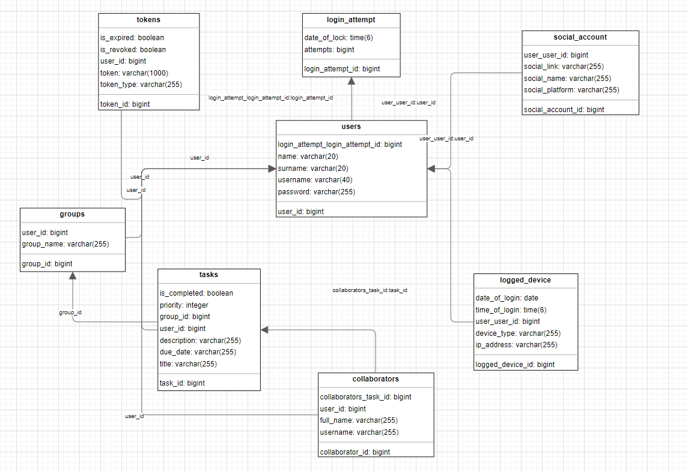
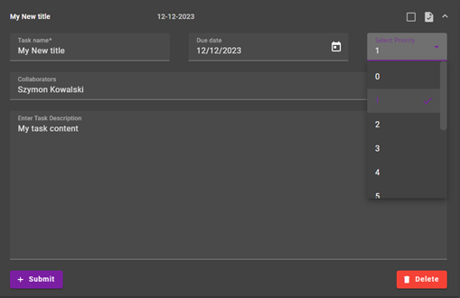

# ToDo App

A simple ToDo app created for the academic course with aim of creating an app with frontend, backend and database.

## How to run it ?

1. App is configured to use HTTPS protocol over http. To use it you need to do following steps.

* Generate ssl self signed certificate:

```bash
keytool -genkeypair -alias app -keyalg RSA -keysize 2048 -storetype PKCS12 -keystore app.p12 -validity 3650 -storepass 25442A472D4B6150645367566B597033733676397924423F4528482B4D625165
```

* Place your file in `todo-app-backend/src/resources/*.p12`

* Check `docker-compose.yml` to contain env variable with appropriate parameters (If you are using same settings as above everything is good)

* Export certificate to `.pem` file:

```bash
openssl pkcs12 -in app.p12 -out app.pem -nodes
```

* Place your .pem file to `todo-app-frontend/src/assets/`.

* If you changed your name check `angular.json` to have appropriate filename.

2. I use RSA private and public keys to sign jwt tokens so you need to generate them.

* Use the commands below to generate private key and create public key:

```bash
openssl genpkey -algorithm RSA -out private.pem -pkeyopt rsa_keygen_bits:4096
openssl rsa -pubout -in private.pem -out public.pem
```

* Place them inside `todo-app-backend/src/resources/*.pem`

## Technology Stack

1. Frontend
*	Angular 16.2.0,
*	TypeScript 5.1.3,
*	Angular Material 16.2.8,
*	Scss 0.2.4,
*	Rxjs 7.8.0,
*	Html 5.

2. Backend
*	Java 17,
*	Spring Boot 3.14,
*	Spring Data JPA,
*	Gradle Groovy,
*	PostgreSQL,
*	MapStruct,
*	Lombok.

3. Others
*	Docker,
*	Nginx,
*	Drawio.

## Diagrams

* Architecture diagram:

<div align="center">
    
</div>

* Database:

<div align="center">
    
</div>

## Screenshots

* Login

<div align="center">
    
</div>

<div align="center">
    
</div>

* Register

<div align="center">
    
</div>

<div align="center">
    
</div>

* Groups

<div align="center">
    
</div>

* Side Menu

<div align="center">
    
</div>

* Profile

<div align="center">
    
</div>

* Collaborators

<div align="center">
    
</div>

* Search

<div align="center">
    
</div>

<div align="center">
    
</div>

<div align="center">
    
</div>

* Tasks

<div align="center">
    
</div>

<div align="center">
    
</div>

<div align="center">
    
</div>

<div align="center">
    
</div>

<div align="center">
    
</div>

<div align="center">
    
</div>

