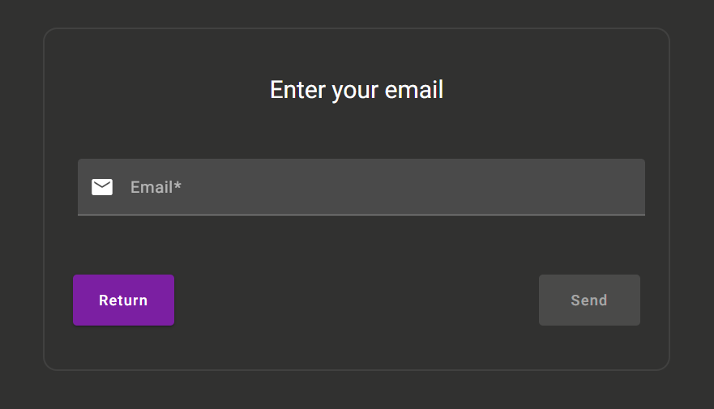
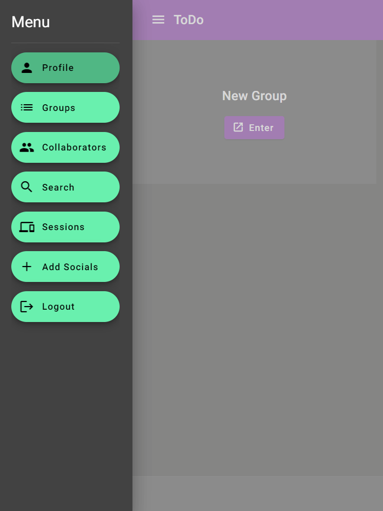
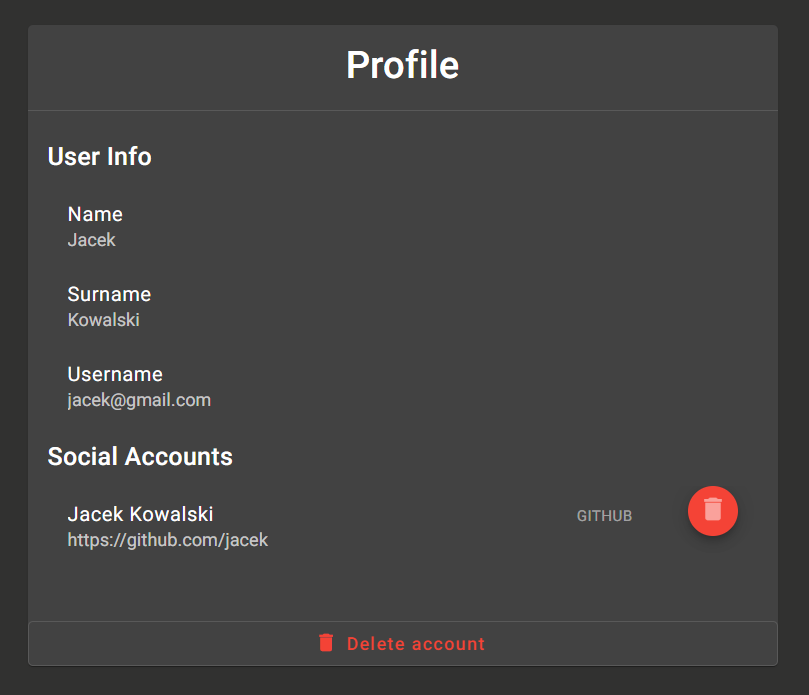

# ToDo App

A simple ToDo app created for the academic course with aim of creating an app with frontend, backend and database. It has support for Https, PWA and is using reverse proxy.

## How to run it ?

1. I use RSA private and public keys to sign jwt tokens so you need to generate them.

* Use the commands below to generate private key and create public key:

```bash
openssl genpkey -algorithm RSA -out private.pem -pkeyopt rsa_keygen_bits:4096
openssl rsa -pubout -in private.pem -out public.pem
```

* Place them inside `todo-app-backend/src/resources/*.pem`

2. Application is using `ssl` so you need appropriate certificates. In `todo-app-nginx/ssl` there is a script `gen.sh` developed by me and my friend [Igor](https://github.com/igorkedzierawski). When you use it you should have `server.crt`, `server.key` and `server.p12`. First two should be placed in `todo-app-frontend/src/assets/ssl/` and `todo-app-nginx/ssl/` and `server.p12` in `todo-app-backend/src/main/resources/`. You can modify particular values in scripts variables.

## Technology Stack

1. Frontend
*	Angular 16.2.0,
*   Angular PWA,
*	TypeScript 5.1.3,
*	Angular Material 16.2.8,
*	Scss 0.2.4,
*	Rxjs 7.8.0,
*	Html 5.

2. Backend
*	Java 17,
*	Spring Boot 3.14,
*	Spring Data JPA,
*   OAuth2,
*   Jwt,
*	Gradle Groovy,
*	PostgreSQL,
*	MapStruct,
*	Lombok.

3. Others
*	Docker,
*	Nginx,
*	Drawio.

## Diagrams

* Architecture diagram:

<div align="center">
    
</div>

* Database:

<div align="center">
    
</div>

## Screenshots

* Login

<div align="center">
    
</div>

* Register

<div align="center">
    
</div>

* Forgot password

<div align="center">
    
</div>

* Groups

<div align="center">
    
</div>

* Side Menu

<div align="center">
    
</div>

* Profile

<div align="center">
    
</div>

* Collaborators

<div align="center">
    
</div>

* Search

<div align="center">
    
</div>

<div align="center">
    
</div>

<div align="center">
    
</div>

* Tasks

<div align="center">
    
</div>

<div align="center">
    
</div>

<div align="center">
    
</div>

<div align="center">
    
</div>

<div align="center">
    
</div>

<div align="center">
    
</div>

* Sessions

<div align="center">
    
</div>

* Add socials

<div align="center">
    
</div>
